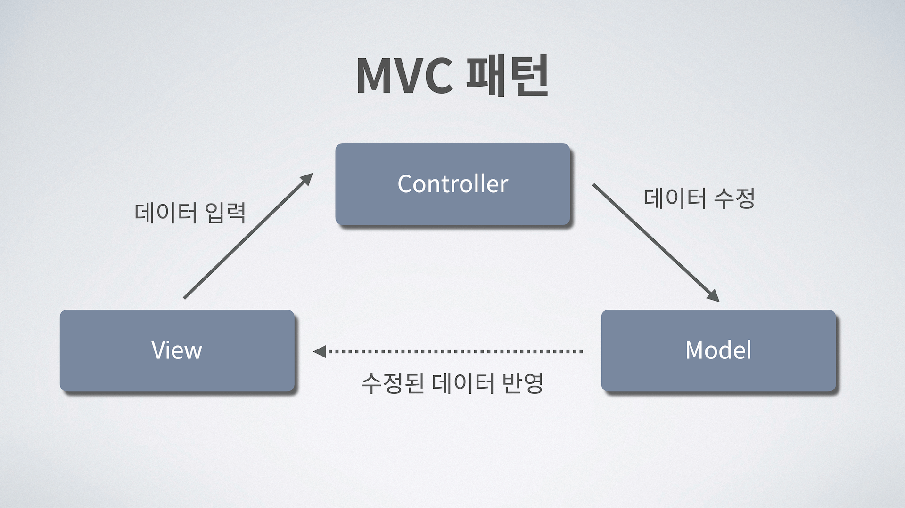
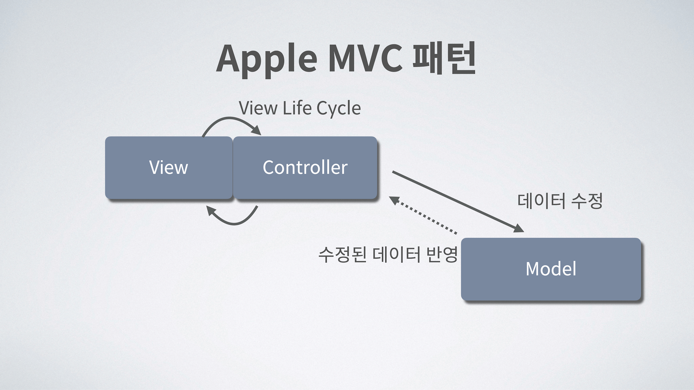
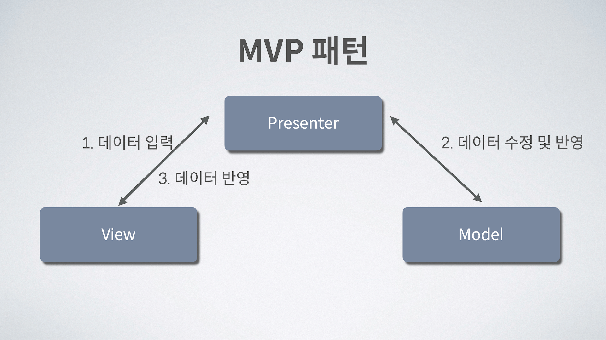
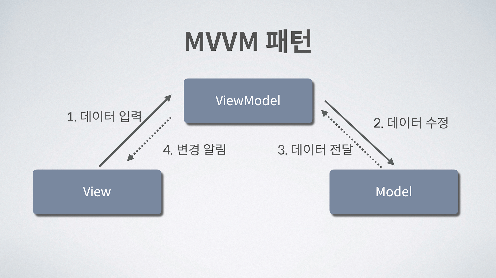
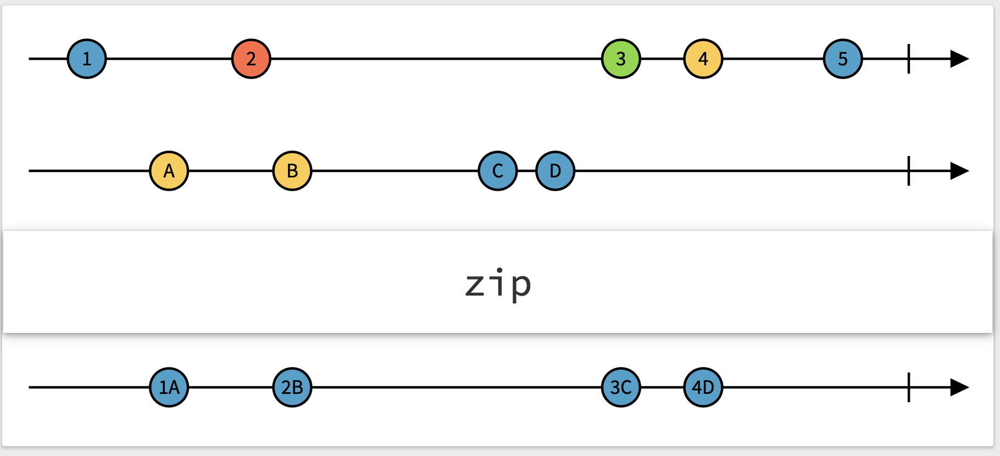
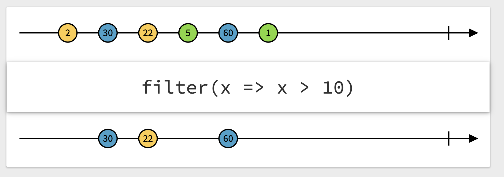

1주차
====
# [목차](#목차)
- [1주차](#1주차)
- [목차](#목차)
- [프로그래밍 패러다임](#프로그래밍-패러다임)
  - [선언형 프로그래밍(Declarative Programming)](#선언형-프로그래밍declarative-programming)
  - [반응형 프로그래밍(Reactive Programming)](#반응형-프로그래밍reactive-programming)
    - [비동기 프로그래밍(Asynchronous)](#비동기-프로그래밍asynchronous)
  - [함수형 프로그래밍(Functional Programming)](#함수형-프로그래밍functional-programming)
- [옵저버 패턴(Observer Pattern)](#옵저버-패턴observer-pattern)
- [iOS의 대표적 모바일 아키텍처 패턴](#ios의-대표적-모바일-아키텍처-패턴)
  - [아키텍처 패턴(Architecture Pattern)이란?](#아키텍처-패턴architecture-pattern이란)
  - [MVC Pattern](#mvc-pattern)
  - [Apple MVC Pattern](#apple-mvc-pattern)
  - [MVP Pattern](#mvp-pattern)
  - [MVVM Pattern](#mvvm-pattern)
- [RxSwift](#rxswift)
  - [Observable](#observable)
  - [Operator](#operator)
  - [Subject / Relay](#subject--relay)
  - [Scheduler](#scheduler)
  - [RxMarbles](#rxmarbles)
- [자료 출처](#자료-출처)


# 프로그래밍 패러다임

## 선언형 프로그래밍(Declarative Programming)
[](https://refactoring.guru/design-patterns/facade)

선언형 프로그래밍 이란?

명령형 프로그래밍과 나름 대조되는 프로그래밍 패러다임
웹 페이지를 개발 한다고 하면,
웹페이지에 제목, 콘텐츠 등 `무엇`이 들어가는가에 중점을 두고,
그 `무엇`을 어떻게 구현할지는, 웹페이지 자체에서 신경쓸 필요가 없다.
다시 `무엇`이 버튼이라고 다시한번 예를 든다면, 어떠한 버튼이 필요할 뿐,
그 버튼이 어떻게 작동하는지에 대한 것은 `버튼`을 개발할 때 필요한 요소들이다.


**구현을 안하는게 아닌,**
**개발하고있는 대상 자체에 집중하는 프로그래밍이 선언형 프로그래밍 패러다임의 핵심이 아닐까 싶다.** 

정자역 -> 네이버까지 가는 루트를 명령형으로 표현한다면..
```
* 횡단보도까지 약 99m 이동
* 횡단보도를 이용하여 경기성남분당경찰서 방면으로 횡단
* 다음 횡단보도까지 1개의 횡단보도를 지나 612m 이동
* 횡단보도를 이용하여 메르세데스벤츠코리아더클래스효성분당전시장 방면으로 횡단
* 네이버까지 약 50m
```

이번에는 이걸 선언형으로 표현한다면..
```
출발: 정자역
도착: 네이버
이동
```

구현을 하지 않는것이 아니며,
구현에 대한 알고리즘이 바뀌는것 또한 아니다.

항목들을 정리하여 조금 더 세분화시켜서, 해당 항목의 개발에만 집중하는것이다.

이것은 Design Pattern중 [Facade Pattern](https://refactoring.guru/design-patterns/facade)과도 비슷한 양상을 보인다.
[](https://refactoring.guru/images/patterns/diagrams/facade/example.png)

## 반응형 프로그래밍(Reactive Programming)
현대의 프로그램들은, 규모와 자본이 폭발적으로 늘어나고 있다.

지난 2019년, 중국의 대명절 광군절에는 중국 최대규모의 쇼핑몰 [알리바바의 초당 거래량이 54만건](https://www.ajunews.com/view/20191210173028807)을 돌파하기도 했었다.

서비스 또한 작게는 모바일기기의 단위부터, 크게는 클라우드 컴퓨팅을 이용한 수천 수만대의 서버에서 운영이 되고 있다.

웹에 있는 데이터 또한 예전같지가 않다.

예전에는 데이터의 크기때문에 모바일 웹을 따로 만들어서 모바일용 이미지들을 따로 컨버팅 했었지만, 요새는 사이즈에 따라 배치만 바뀌는 반응형 웹이 주가 되었다.

그에 따라서 시스템의 자원소모를 최소한으로 줄여야할 방법이 필요한데,
현대 프로그래밍(Modern Programming)에서 각광받는 방법중 하나가 바로 반응형 프로그래밍 이다.(Reactive Programming)

아래는 반응형 프로그래밍의 대표적인 예시이다.

```
만원짜리 상품을 구매하는 페이지에 들어가는데,
30%할인 쿠폰을 적용하여 7천원으로 금액을 바꿔준다.
10,000원 -> 7,000원의 숫자를 변경하는데 페이지 전체를 새로고칠 필요는 없다.
10,000을 7,000으로만 변경해주면 된다.
```

[리액티브 선언문](https://www.reactivemanifesto.org)에 따르면, 리액티브 프로그래밍 패러다임은 다음과 같은 특징을 갖는다.
* 응답성(Responsive)
  * 시스템은 최대한 빠르게 즉각적으로 응답하는것을 목표로 한다.
* 탄력성(Resilient)
  * 시스템에 장애가 생기더라도 응답성을 유지한다.
  * 복제, 봉쇄, 격리, 위임에 의해 실현이 된다.
* 유연성(Elastic)
  * 작업량이 늘어나도 응답성을 유지한다.
  * 병목현상이 최대한 적도록 설계한다
* 메시지 구동(Message Driven)
  * 비동기 메시지 전달에 의존하여, 느슨한 결합, 격리, 위치 투명성을 보장한다.

[](https://www.reactivemanifesto.org/)

### 비동기 프로그래밍(Asynchronous)
논리적 입장에서 동시에 한가지의 일만 하는게 좋긴 하다. (동기 프로그래밍)
하지만 한가지 예로, 네트워크가 들어가게 된다면, 동기 프로그래밍은 많이 힘들다.
쿠팡앱을 켰을 때, 배너, 카테고리 목록, 상품목록이 가장 먼저 보일텐데..
순서대로 배너, 카테고리, 상품을 불러와야할 때,
이걸 동기프로그래밍으로 개발하게된다면.. 사용자는 병목현상을 느끼게 된다.
이것들을 최대한 한번에 나타나게 해줘야하는데, 이것이 비동기 프로그래밍이다.

여담으로, 비동기 프로그래밍을 하다보면 필연적으로 스레드에 관한 개념을 공부해야하는데,
여기서 물리적 스레드와 개발에서 이용하는 스레드는 다르다.
(둘간의 연결은 OS에서 처리한다.)

하지만, 왜 UI는 메인스레드에서만 작동해야할까?

이부분을 생각해보면 동시성에 관한 개념을 공부해볼 수 있다.


## 함수형 프로그래밍(Functional Programming)
[](https://ko.wikipedia.org/wiki/%ED%95%A8%EC%88%98)

말 그대로 ['함수'](https://ko.wikipedia.org/wiki/%ED%95%A8%EC%88%98)형 프로그래밍.

간단하게 풀어보면, 어디에든 대입이 가능해야하며, 입력에따른 출력이 변함이 없어야 한다.

입력에 따른 출력이 변함이 없다는 것은..

```Swift
let krw = 1180
func nonFunctionalCurrency(dollor: Int) -> Int {
    return dollor * krw // 여기에서 쓰이는 krw는 함수 외부의 값에 의존함으로, 순수함수가 아니다. (=참조 투명성이 없다.)
}

func functionalCurrency(dollor: Int) -> Int {
    let krw = 1180
    return dollor * krw // 외부에 의존하는 값이 없다. 항상 같은 값이 들어오면, 같은 값이 나간다. (=불변성)
}
```

어디에든 대입이 가능하다는 것은..

```Swift
func one() -> Int { return 1 }
func two() -> Int { return 2 }

let sum = one() + two() // 변수처럼 이용
func sum2 (one: Int, two: Int) -> Int { return one + two }

func sum3(_ sum: (Int, Int) -> Int) -> Int {
    return sum
}

let result = sum3(sum2(1, 2)) // 매개변수도 가능

let observable: Observable<Int> {
    return subject.asObservable() // 이름이 없는 익명함수
}

```

개인적으로 함수형 프로그래밍은, 교과서처럼 A, B, C, D조건에 만족해야한다 라는 교과서 같은 정의보다는,
직접적으로 어떤 느낌인지 간단하게 알아가는게 중요하다고 생각하지만, 그래도 정리를 해 보자면..

`불변성을 가진 1급 객체의 순수함수`

# 옵저버 패턴(Observer Pattern)
[](https://refactoring.guru/images/patterns/content/observer)

1:N의 관계를 가진 디자인 패턴.
대상을 정해 구독을 시작한다.
옵저버가 구독자들에게 통지할 경우가 생기면, 메시지를 통해 데이터를 통지해준다.
[](https://refactoring.guru/images/patterns/content/observer)

# iOS의 대표적 모바일 아키텍처 패턴
## 아키텍처 패턴(Architecture Pattern)이란?
[](https://ko.wikipedia.org/wiki/%EB%B0%94%EB%A1%9C%ED%81%AC_%EA%B1%B4%EC%B6%95)

* 소프트웨어판 프로젝트 건축 양식
* 코드를 조금 더 구조화 시켜주는 일반화된 솔루션

## MVC Pattern

* 가장 많이 알려지고, 익숙한 아키텍처 패턴 (=그만큼 간단함)
* Model, View, Controller로 쉽게 설계가 가능.
* Model과 View가 상당히 의존적임.
* 프로젝트가 커질수록(=복잡해질수록) Controller 유지보수가 쉽지 않음

## Apple MVC Pattern

* View와 Controller를 결합시킨 패턴.
* 매우 쉽고 간편함.
* 프로젝트가 커질수록 ViewController가 방대해짐
* 그만큼 유지보수 또한 힘들어짐.
* Model과 VC가 의존적이기 때문에, 단위테스트 또한 쉽지 않음.

## MVP Pattern

* Model과 View간의 의존성이 떨어짐
* (논리적 로직에 한해) 유닛테스트가 비교적 수월해짐
* 기능의 수정 및 추가가 용이함
* View와 Presenter가 1:1의 관계를 가지므로, 의존성이 상당히 높은편임.
* MVC와 비슷하게 프로젝트가 커질수록 Presenter에 책임이 가중됨 (=방대해짐)

## MVVM Pattern 

* 옵저버패턴을 이용하여, 각각의 의존성을 최소화시킴
* 모듈화, 유닛테스트가 상당히 용이해짐
* 1:1이 아닌, 1:N의 구조이기 때문에 ViewModel설계시 많은 가능성을 염두해야함
* MVVM을 도입하기 위한 기술적 러닝커브 존재

# RxSwift
**RxSwift란?**
[](https://github.com/ReactiveX/RxSwift)

* 관찰 가능한 스트림을 이용한 비동기 프로그래밍 API
  * 
* Reactive eXtension (=반응형 확장)
* 대중적으로 사용하는 거의 모든 언어, 프레임워크용 라이브러리가 존재.
* 선언형이면서, 반응형이면서, 함수형 프로그래밍이기도 한, 3가지의 패러다임의 성격을 모두 띄고 있음.

## Observable
* RxSwift의 기본이 되는, `스트림`을 가지고 있는 기본 `시퀀스`.
  * 한글로 조금 더 풀어서 설명 하자면..
  * 스트림 = 흐르는 데이터
  * 시퀀스 = 대상(스트림)을 처리하는 순서들을 이루는 구성
  * 스트림을 가지고 있는 시퀀스 -> 흐르는 데이터를 처리하는 로직(=함수의 작동..?)
  * RxSwift는 Observable과 Observable을 변형한 다양한 `Trait`들로 구성되어 있음.
  
## Operator
  * 데이터들을 처리하는 함수들
  * `merge`, `filter`, `time`등 일반적인 연산 함수들이 함수형 프로그래밍 기법으로 개발되었음.
  
## Subject / Relay
  * `Observable`을 감싸서, Status(=일단은 데이터라고 받아들이면 편함)를 저장하고 있는 변수.
  * 시퀀스가 아닌 `시퀀스를 가지고 있는 변수`
  
## Scheduler
  * Swift의 Scheduler + Thread
  * 작동할 시점과 작동할 스레드를 설정할 수 있음.
  
## RxMarbles
[](https://rxmarbles.com)

[](https://rxmarbles.com)
* Operator들을 이해하기 쉽게 표현한 그림.
* 대부분의 연산들은 [공식문서](http://reactivex.io/documentation/ko/operators.html)와[RxMarbles](https://rxmarbles.com/)에서 확인 가능.
  * RxSwift의 자료들이 없더라도, 다른 언어들에서 확인하는것과 크게 차이나지 않음.
* 기호
  * ->: 시간
  * O: 데이터 스트림
  * ㅁ: Operator
  * |: Complete
  * X: Error


# 자료 출처
* 선언형 프로그래밍에 대한 자료 - 위키백과[(선언형 프로그래밍)](https://ko.wikipedia.org/wiki/%EC%84%A0%EC%96%B8%ED%98%95_%ED%94%84%EB%A1%9C%EA%B7%B8%EB%9E%98%EB%B0%8D)
* 선언형 프로그래밍에 이용된 이미지 - [Refactoring Guru](https://refactoring.guru)
* 리액티브 프로그래밍 - [리액티브 선언문](https://www.reactivemanifesto.org)
* 함수형 프로그래밍 - [위키백과](https://ko.wikipedia.org/wiki/%ED%95%A8%EC%88%98%ED%98%95_%ED%94%84%EB%A1%9C%EA%B7%B8%EB%9E%98%EB%B0%8D)
* 옵저버 패턴 - [위키백과](https://ko.wikipedia.org/wiki/%EC%98%B5%EC%84%9C%EB%B2%84_%ED%8C%A8%ED%84%B4), [Refactoring Guru](https://refactoring.guru/design-patterns/observer)
* RxSwift - [공식문서](http://reactivex.io/)
* 그 외 - 이전에 공부하며 제작한 [PT](resources/RxSwift.key)와 [영상](https://youtu.be/3_dyVj4HcYk)